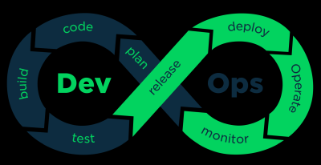

##### initial input for group assignment

# Information About George Brown 
[History of George Brown](https://en.wikipedia.org/wiki/George_Brown_College)

# Information About COMP 3104 

**Three main tools used in COMP 3104**
- Github
- Jenkins
- Travis CI

# Learning DevOps Engineer in Software Development Cycle

*Top Ten Skill Require for DEVOPS Engineers*

1. Communication and Collaboration
2. Soft Skills and Noble Thought
3. Understanding of Relevant Tools
4. Security Skills
5. Automation Skills
6. Coding and Scripting
7. Cloud Skills
8. Testing Skills
9. Customer-Focused Approach
10. Proactiveness

[Expanded Top Ten Skill List](https://www.veritis.com/blog/top-10-skills-that-make-a-perfect-devops-engineer/)